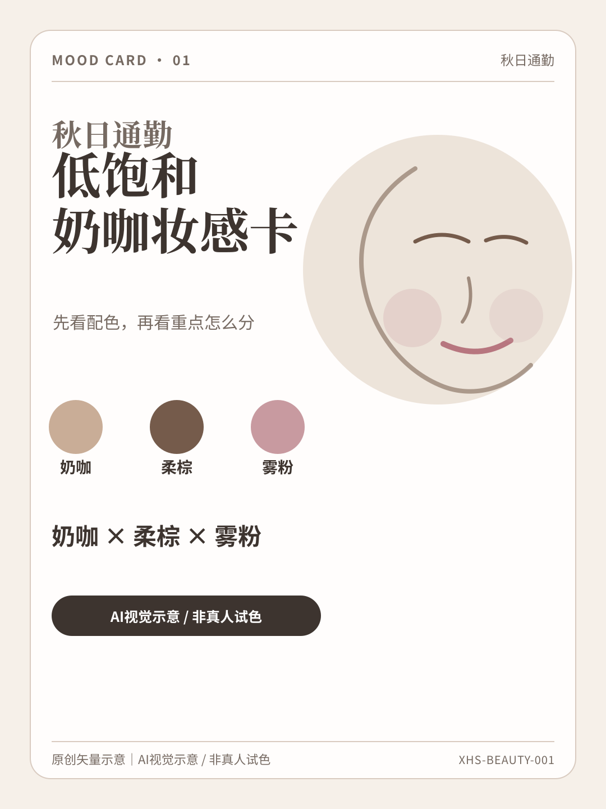
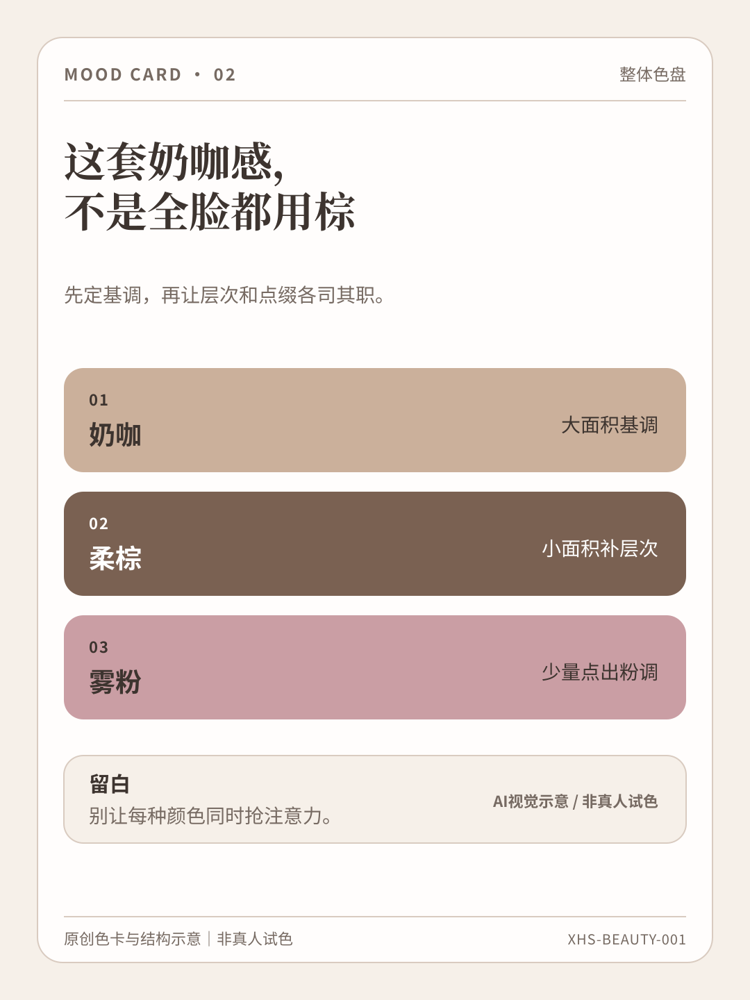
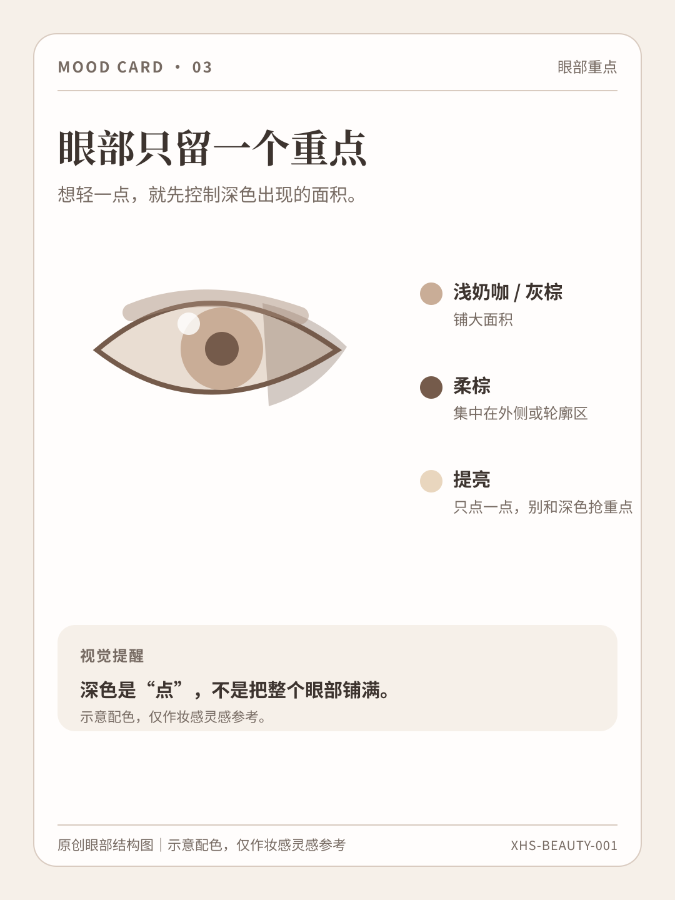
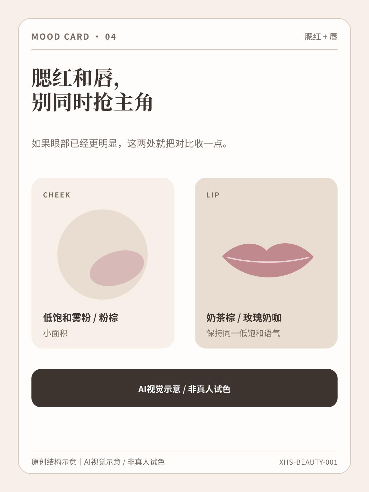
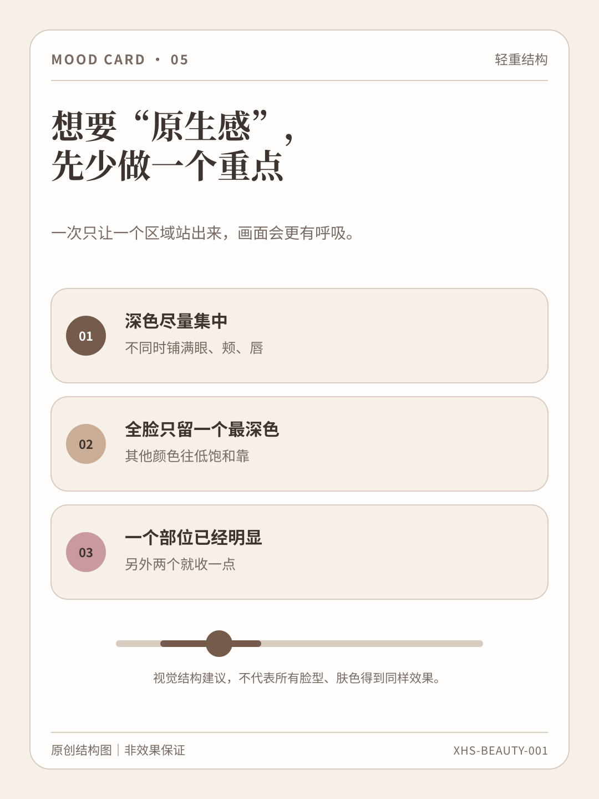
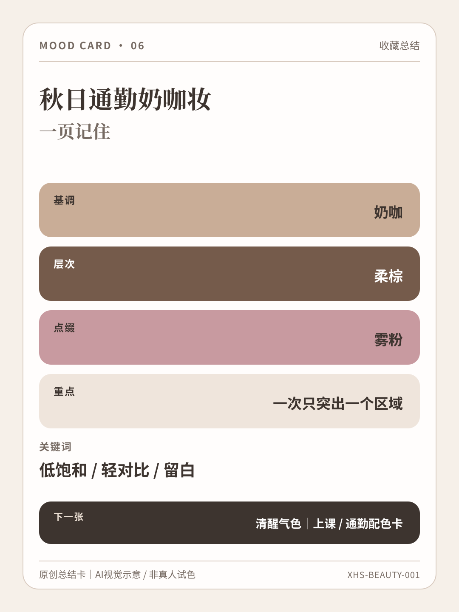

# CONTENT-001｜6页视觉成稿总览

> 状态：视觉制作完成，待内容与合规审核；**不可直接发布**。

## P1 封面

## P2 整体色盘

## P3 眼部重点

## P4 腮红 + 唇

## P5 轻重结构

## P6 收藏总结

说明：6页均为原创矢量图形与原创排版；未使用外部摄影、真人照片、品牌图、产品图或真人试色。涉及妆面/部位的内容均为抽象结构示意，不作为真实效果证据。
