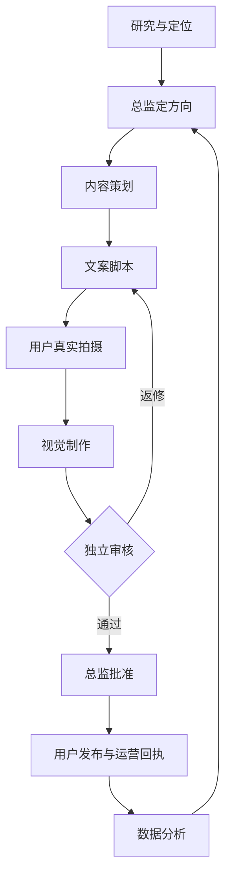

# 普通聊天版｜美妆IP角色工作流
每个角色一个独立聊天；首次复制对应角色完整指令。所有角色共用同一个GitHub仓库，只写自己的产物。用户每天提供真实素材、后台截图并执行发布，AI按角色分工往下交接。

## 开聊顺序
先建总监、研究、策划、文案、视觉、审核、运营、数据八个聊天；可以用到哪个再建哪个。投放和商务在有实际需求时启用。所有角色都已写好模型建议，详见系统/模型与角色速查.md。
第一条消息：复制角色文件全部内容。第二条消息：发送上一角色给出的交接句。后续只需发送交接句，不重复粘贴规则或搬运产物。
普通聊天必须实际具备可用的GitHub读取和写入工具，才可承诺直连；若某个聊天不具备，明确报告，交给已有权限的总监入库。换聊天不改变这个能力前提。

## 内容闭环

最多两轮返修仍未通过，就由总监补证、换题或取消。素材有问题直接退用户补拍；不能通过改文案掩盖假素材。

## 支线怎样接入
| 情况 | 交给谁 | 交付以后 |
|---|---|---|
| 开新号/方向不清 | 研究与定位 | 总监确认定位 |
| 自然内容表现可重复，准备测试投流 | 增长投放 | 用户批准具体预算后执行，数据分析复盘 |
| 品牌来问合作 | 商务与财务 | 总监确认适配和成本，用户确认条款，进入内容闭环 |
| 商单完成且收到钱 | 商务与财务 | 核对利润与现金，总监提复投方案，用户批准 |
| 聊天太长 | 原角色保存续接卡 | 新聊天按相同角色从仓库续接 |

## 每天你只需做什么
1. 把后台截图交数据分析AI；没有历史内容的第一天先填首次资料。
2. 把数据员末尾交接句发给总监，由总监决定当天做什么。
3. 按各角色末尾的“下一步发送给……”逐个交接；拍摄和发布由你按清单做。
4. 发布以后，把真实链接给运营AI，等待正常观察窗口，再交数据AI。

这个流程无需为每个角色再付一份会员。是否可选择模型、能否读写GitHub、实际额度均以你当前界面为准；多开聊天不会自动获得更多额度。
完整目标是把广告型IP做到盈利并扩大到10万真实粉丝；流程闭环并不代表效果已经验证。没有真实数据时先做小规模验证。
